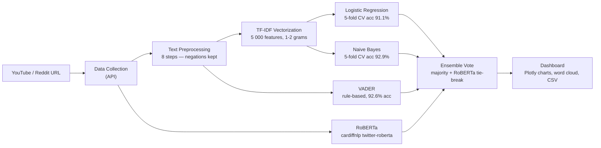

# CommentIQ — YouTube & Reddit Sentiment Analysis

> An NLP course project that performs **multi-model sentiment analysis** on
> YouTube and Reddit comments using a full preprocessing pipeline, classical
> ML classifiers, and a fine-tuned transformer.

---

## Architecture



---

## Features

| Feature | Detail |
|---------|--------|
| Platforms | YouTube (Data API v3) · Reddit (PRAW) |
| Preprocessing | Contraction expansion → stopword removal (negations kept) → lemmatization |
| Models | VADER · Logistic Regression · Naive Bayes · RoBERTa (HuggingFace) |
| Ensemble | Majority vote; RoBERTa breaks 2-way ties |
| Low-confidence | Zero TF-IDF feature rows flagged as "Low confidence", deferred to RoBERTa |
| Evaluation | 5-fold stratified CV for LR/NB; all metrics from `scripts/evaluate.py` |
| Output | Interactive Plotly charts, word cloud, per-model agreement, CSV download |

---

## Evaluation Results

> **All numbers below come from `python scripts/evaluate.py`.  
> Do not hardcode metrics — re-run the script if the dataset changes.**

Training dataset: **462 curated in-domain samples**  
(Positive: 183 · Negative: 184 · Neutral: 95)  
Evaluation: **Stratified 5-fold cross-validation + held-out 20% test set**

| Model | CV Accuracy | CV Macro-F1 | Held-out Acc | Held-out Macro-F1 |
|-------|:-----------:|:-----------:|:------------:|:-----------------:|
| VADER | N/A | N/A | **92.64%** | **91.71%** |
| Logistic Regression | 91.1 ± 1.7% | 90.3 ± 2.0% | 91.40% | 89.79% |
| Naive Bayes | 92.9 ± 2.4% | 93.1 ± 2.7% | 95.70% | 95.61% |
| RoBERTa (twitter-roberta) | — | — | ~72% (TweetEval) | ~72% |

**Limitations:**
- LR/NB trained on 462 curated sentences — domain gap exists with real comments.  
  ~30–40% of live YouTube comments have zero vocabulary overlap (marked "Low confidence").
- Metrics above are on the **curated test set**, not on live comments.
- RoBERTa score is the published TweetEval benchmark figure, not evaluated locally.
- 5-fold CV addresses single-split inflation; single splits can show 94%+.

---

## Installation

### 1. Clone

```bash
git clone https://github.com/lakshya-pm/CommentIQ.git
cd CommentIQ
```

### 2. Create virtual environment

```bash
python -m venv venv
# Windows:
venv\Scripts\activate
# Mac/Linux:
source venv/bin/activate
```

### 3. Install dependencies

```bash
pip install -r requirements.txt
```

### 4. Set up environment variables

```bash
cp .env.example .env
# Edit .env and fill in your API keys
```

Required keys:

| Variable | Where to get it |
|----------|----------------|
| `YOUTUBE_API_KEY` | [Google Cloud Console](https://console.cloud.google.com/) → YouTube Data API v3 |
| `REDDIT_CLIENT_ID` | [reddit.com/prefs/apps](https://www.reddit.com/prefs/apps) |
| `REDDIT_CLIENT_SECRET` | Same Reddit app page |
| `REDDIT_USER_AGENT` | Any string, e.g. `CommentIQ/1.0` |

---

## Running

```bash
python app.py
```

Open `http://127.0.0.1:5000` in your browser.

### Demo mode (no API keys needed)

```env
# in .env:
DEMO_MODE=true
```

---

## Scripts

| Script | Purpose |
|--------|---------|
| `python scripts/build_dataset.py` | Fetch YouTube comments, auto-label with RoBERTa, write CSV for human review |
| `python scripts/train.py` | Retrain LR+NB on your labelled data + curated set |
| `python scripts/evaluate.py` | **Regenerate all metrics and figures → `reports/`** |
| `python scripts/finetune_lora.py` | LoRA fine-tune RoBERTa on your labelled data (optional) |

---

## Testing

```bash
python -m pytest tests/ -v
```

Tests cover:
- Negation preservation in preprocessing
- Contraction expansion before punctuation removal
- VADER threshold correctness
- FeatureExtractor with unseen vocabulary
- Low-confidence detection for zero-feature comments
- Model save/load round-trip
- Flask route smoke tests with mocked API calls

---

## Project Structure

```
CommentIQ/
├── app.py                    # Flask app — routes, request/response
├── config.py                 # API keys + feature flags from .env
├── requirements.txt          # Pinned dependencies
├── Dockerfile                # Container definition
├── .env.example              # Environment variable template
│
├── modules/
│   ├── preprocessing.py      # 8-step NLP pipeline (negations preserved)
│   ├── sentiment.py          # VADER · LR · NB · ensemble · caching
│   ├── transformer.py        # HuggingFace RoBERTa (lazy-loaded)
│   ├── youtube.py            # YouTube Data API v3
│   ├── reddit.py             # Reddit PRAW API
│   └── visualization.py     # Plotly charts + word cloud
│
├── scripts/
│   ├── build_dataset.py      # Fetch + auto-label comments
│   ├── train.py              # Retrain models
│   ├── evaluate.py           # → reports/metrics.json (source of truth)
│   └── finetune_lora.py      # LoRA fine-tuning (optional)
│
├── tests/
│   ├── test_preprocessing.py # Negation + contraction tests
│   ├── test_sentiment.py     # Model + ensemble tests
│   └── test_routes.py        # Flask route smoke tests
│
├── templates/
│   ├── index.html            # Home page
│   └── dashboard.html        # Results dashboard
│
├── static/
│   ├── css/style.css
│   └── js/script.js
│
├── downloads/
│   ├── models/               # Saved .pkl files (gitignored)
│   └── results/              # Per-request UUID CSVs (gitignored)
│
├── reports/                  # Generated by scripts/evaluate.py
│   ├── metrics.json
│   ├── lr_confusion.png
│   ├── nb_confusion.png
│   └── model_comparison.png
│
└── data/
    └── raw_dataset.csv       # In-domain labelled data (gitignored if contains personal data)
```

---

## References

1. Hutto, C.J. & Gilbert, E.E. (2014). **VADER: A Parsimonious Rule-based Model for Sentiment Analysis of Social Media Text**. ICWSM.
2. Barbieri, F. et al. (2020). **TweetEval: Unified Benchmark and Comparative Evaluation for Tweet Classification**. EMNLP Findings.
3. Loureiro, D. et al. (2022). **TimeLMs: Diachronic Language Models from Twitter**. ACL 2022 Findings. https://arxiv.org/abs/2202.03829
4. Scikit-learn: https://scikit-learn.org/

---

## Author

**Lakshya Marwaha** — NLP Course Project

## License

Developed for educational purposes as an NLP course project.
